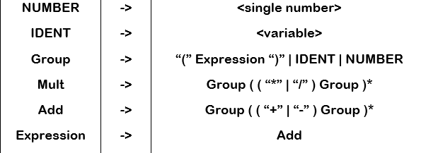

# ArithmeticExpressions
Solution for simplifying arithmetic expressions including variables.
Based on creating an Abstract Syntax Tree and a folowing analysis.
### Syntax Grammars for building the AST:

